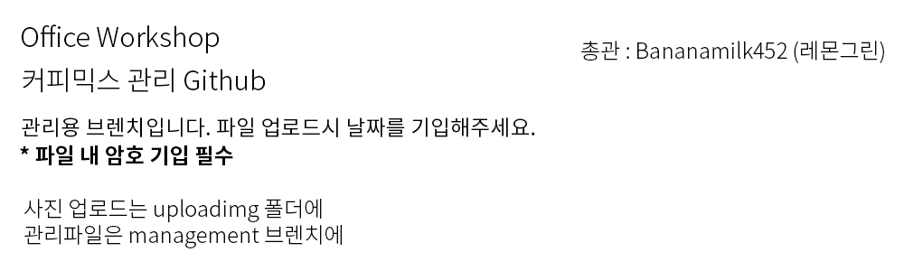

# 오피스 워크샵 커피믹스 리스트

업로드 규칙
---
management 브렌치 자체에 업로드 하는 대신, 월별로 폴더를 나누어서 만들고
설명에 날짜 기입을 바랍니다.
그리고 파일 내 암호가 필수입니다.

사용 프로그램
---
Github는 아직 한글을 제데로 지원하지 않습니다.
따라서 직접 메모장에 써서 업로드 하는 방법을 추천합니다.
또한, 관리는 엑세스나 엑셀을 사용해서 관리를 할 예정입니다.
