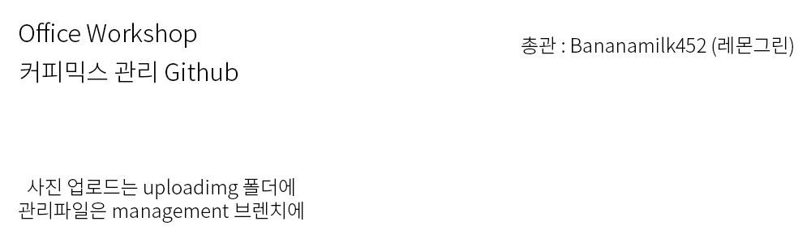

# 오피스 워크샵 커피믹스 리스트

문서 작성
---
깃허브는 문서를 작성할 때 문서 확장자 .md를 사용하는데,
여러분이 문서를 만들때도 문서이름.md로 만들어야 한다.
그리고 README.md는 폴더에 들어갔을 때 자동으로 뜨는 파일을 뜻한다.
강좌 : [깃허브 늅늅이를 위한 가이드](guide.md)

가입
---
관리자 인증을 위해 오피스 워크샵 닉네임으로 해주세요.

사용 프로그램
---
Github는 아직 한글을 제데로 지원하지 않습니다.
따라서 직접 메모장에 써서 업로드 하는 방법을 추천합니다.
또한, 관리는 엑세스나 엑셀을 사용해서 관리를 할 예정입니다.
